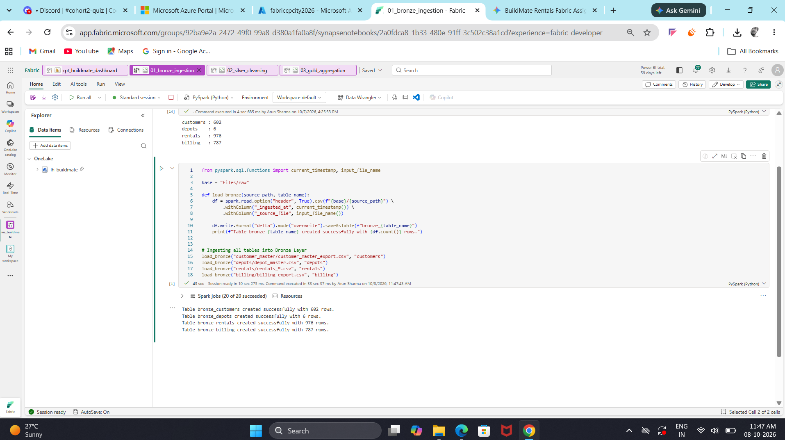
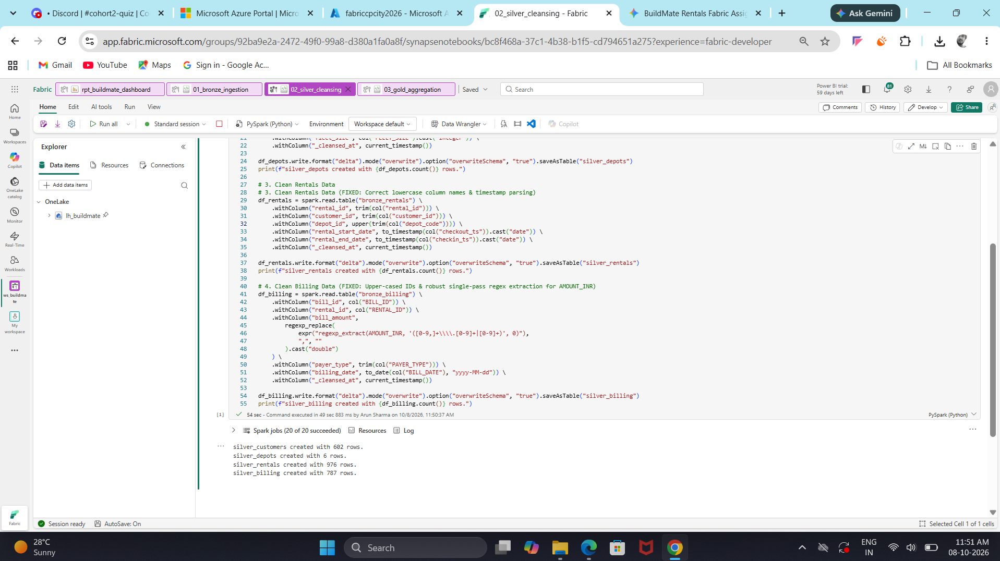
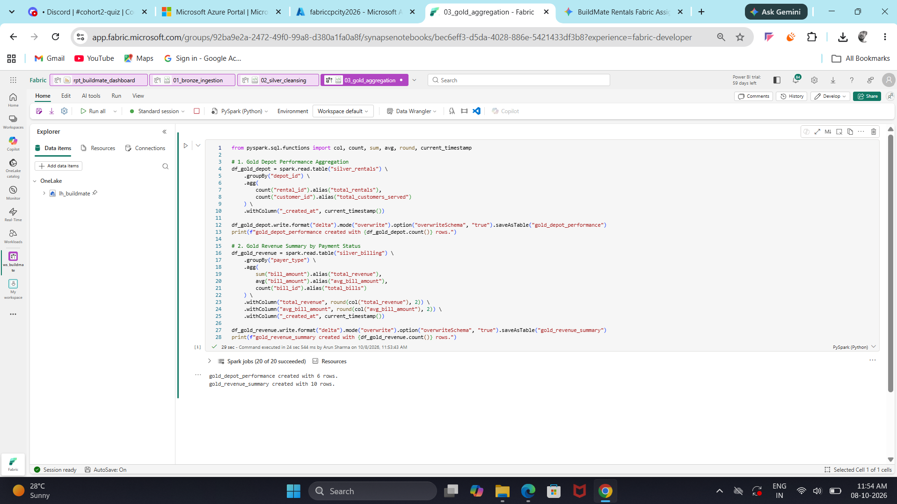

# BuildMate Rentals — Fabric Medallion Pipeline

Full batch Medallion pipeline built on Microsoft Fabric using PySpark notebooks and Delta Lake, connected to a Power BI DirectLake report.

---

# Task 4 Answers & Insights

* **Machines Currently Out:** 175 machines are actively rented on site.
* **Null-Safety Note:** Using a null-safe filter in Silver saved all 175 active rentals from being silently deleted (since their check-in time is blank while still out on site).

---

## Task 5: Fabric Shared Capacity

Fabric shares computing capacity across the entire workspace. A heavy, unoptimized Spark job can consume too many Capacity Units (CUs), slowing down DirectLake report refreshes and other team members' queries. To keep things running smoothly, notebooks should close idle sessions.
---

## Project Structure

* `01_bronze_ingestion.ipynb` — Raw data ingestion with string schema & lineage tags
* `02_silver_cleansing.ipynb` — Deduplication, null-safe quality rules & date parsing
* `03_gold_aggregation.ipynb` — Star schema creation, ZORDER optimization & analysis

### Execution Proofs

**1. Bronze Layer Ingestion**

**2. Silver Layer Cleansing & Quality Checks**

**3. Gold Layer Star Schema & Optimization**

